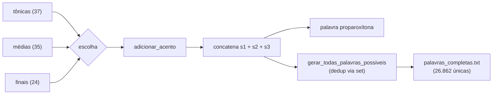

# egera-generator

Gerador de palavras proparoxítonas de três sílabas em português. Combina sílabas tônicas, médias e finais para formar palavras inventadas com acento na primeira sílaba, usáveis como apelidos para "égera".

[](https://github.com/fabricioguidine/egera-generator/actions/workflows/ci.yml) [](https://www.python.org/) [](LICENSE)

Pode ser usado de forma interativa pelo terminal, importado como módulo Python, ou executado em lote para gerar o conjunto completo de palavras únicas.

## Contexto

Os adjetivos "égera", "pécora", "épene" e "cípora" são palavras inexistentes na língua portuguesa, sem significado objetivo ou reconhecido. O projeto gera variações no mesmo padrão fonético (proparoxítonas de três sílabas).

- [Dicionário Informal - Égera](https://www.dicionarioinformal.com.br/%C3%A9gera/)
- [Dicionário Informal - Pécora](https://www.dicionarioinformal.com.br/p%C3%A9cora/)

## Features

- **Geração aleatória** — uma ou múltiplas palavras sorteadas (`gerar_palavra`, `gerar_multiplas`).
- **Geração completa** — todas as combinações únicas possíveis, sem duplicatas (`gerar_todas_palavras_possiveis`).
- **Acentuação automática** — acento agudo na primeira vogal da sílaba tônica (`adicionar_acento`).
- **Validação** — confere se a palavra tem 3 sílabas e acento na primeira (`validar_proparoxitona`).
- **Lista pré-gerada** — `palavras_completas.txt` com 26.862 palavras únicas, uma por linha.
- **Sem dependências de runtime** — usa apenas a biblioteca padrão.

## Requisitos

- Python 3.10 ou superior.
- Para desenvolvimento e testes: `pytest`, `pytest-cov`, `hypothesis`, `ruff`, `mypy` (extra `dev` em `pyproject.toml` ou `requirements.txt`).

## Instalação

```powershell
git clone https://github.com/fabricioguidine/egera-generator.git
cd egera-generator
pip install -e ".[dev]"
```

## Uso

Execução interativa — pergunta quantas palavras gerar e as imprime:

```powershell
python gerador.py
```

Gerar todas as palavras em lote — embaralha e (sobre)escreve `palavras_completas.txt`:

```powershell
python gerar_todas_palavras.py
```

Como módulo:

```python
from gerador import GeradorEgera

gerador = GeradorEgera()
print(gerador.gerar_palavra())            # uma palavra
gerador.gerar_multiplas(20)               # lista de 20
gerador.calcular_maximo_palavras()        # 31080 (combinações teóricas)
gerador.validar_proparoxitona("prótula")  # True
```

## Como funciona

Três listas de sílabas (37 tônicas, 35 médias, 24 finais) geram 37 × 35 × 24 = 31.080 combinações teóricas; após remover duplicatas restam 26.862 palavras únicas.



## Testes

```powershell
pytest
```

A suíte cobre geração, validação, acentuação, ausência de duplicatas, integridade de `palavras_completas.txt` e propriedades verificadas com Hypothesis. Cobertura já configurada em `pyproject.toml`.

## Estrutura do projeto

```
egera-generator/
├── gerador.py                # Classe GeradorEgera e CLI interativa
├── gerar_todas_palavras.py   # Gera todas as palavras possíveis -> TXT
├── palavras_completas.txt    # 26.862 palavras únicas (uma por linha)
├── pyproject.toml            # Metadados, ruff, mypy, pytest, coverage
├── pytest.ini                # Configuração do pytest
├── requirements.txt          # Dependências de desenvolvimento/teste
└── tests/                    # Testes unitários, de propriedade e smoke
```

## Licença

Distribuído sob a licença MIT. Veja [`LICENSE`](LICENSE).
