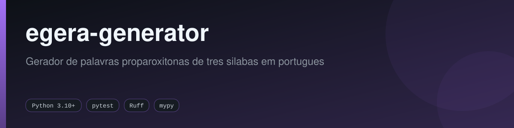
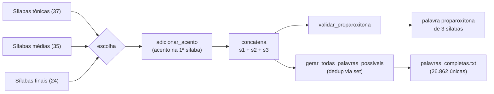

<div align="center">



[](https://github.com/fabricioguidine/egera-generator/actions/workflows/ci.yml) [](https://codecov.io/gh/fabricioguidine/egera-generator) [](https://github.com/astral-sh/ruff) [](https://mypy-lang.org/) [](https://www.python.org/) [](LICENSE)

</div>

> Gerador de palavras proparoxítonas de três sílabas em português, para criar apelidos em potencial para "égera".

`egera-generator` combina sílabas tônicas, médias e finais para formar palavras proparoxítonas de três sílabas (acento na primeira sílaba). Pode ser usado de forma interativa pelo terminal, importado como módulo Python, ou executado em lote para gerar o conjunto completo de palavras únicas possíveis.

## Sumário

- [Contexto](#contexto)
- [Características](#características)
- [Como funciona](#como-funciona)
- [Requisitos](#requisitos)
- [Instalação](#instalação)
- [Uso](#uso)
- [Saída](#saída)
- [Estrutura do projeto](#estrutura-do-projeto)
- [Testes](#testes)
- [Licença](#licença)

## Contexto

Os adjetivos 'égera', 'pécora', 'épene' e 'cípora' utilizados contra a parte autora são palavras inexistentes na língua portuguesa, não possuindo, portanto, significado objetivo ou reconhecido que permita aferir sua suposta conotação ofensiva.

**Referências:**
- [Dicionário Informal - Égera](https://www.dicionarioinformal.com.br/%C3%A9gera/)
- [Dicionário Informal - Pécora](https://www.dicionarioinformal.com.br/p%C3%A9cora/)
- [Twitter/X - Pitoreixco](https://x.com/pitoreixco/status/1992735842310508561/photo/1)

## Características

- Gera palavras de 3 sílabas com acento tônico na primeira sílaba (proparoxítonas).
- Acentuação automática da sílaba tônica via `adicionar_acento`.
- Validação das palavras geradas via `validar_proparoxitona`.
- Geração de uma palavra, de múltiplas palavras, ou de todas as combinações únicas possíveis.
- Cálculo do número máximo teórico de combinações.
- Lista completa pré-gerada em [`palavras_completas.txt`](palavras_completas.txt) (uma palavra por linha, em ordem aleatória).

## Como funciona

O gerador parte de três listas de sílabas — **37 tônicas**, **35 médias** e **24 finais**. Para cada palavra, escolhe uma sílaba de cada lista, garante o acento agudo na primeira sílaba e concatena as três. A combinação completa dá **37 × 35 × 24 = 31.080** combinações teóricas; removendo as duplicatas (combinações distintas que produzem a mesma palavra), restam **26.862 palavras únicas**.



- **`gerar_palavra()`** — sorteia uma sílaba de cada lista e devolve uma palavra.
- **`gerar_multiplas(quantidade=10)`** — devolve uma lista de N palavras sorteadas.
- **`gerar_todas_palavras_possiveis()`** — itera todas as combinações e remove duplicatas.
- **`calcular_maximo_palavras()`** — retorna 37 × 35 × 24 = 31.080.
- **`validar_proparoxitona(palavra)`** — confere 3 vogais e acento na primeira sílaba.

## Requisitos

- Python 3.10 ou superior.
- O gerador não tem dependências de runtime (usa apenas a biblioteca padrão).
- Para desenvolvimento e testes: `pytest`, `pytest-cov`, `hypothesis`, `ruff` e `mypy` (ver `requirements.txt` ou o extra `dev` em `pyproject.toml`).

## Instalação

```powershell
git clone https://github.com/fabricioguidine/egera-generator.git
cd egera-generator
```

Para desenvolvimento e testes:

```powershell
pip install -e ".[dev]"
# ou
pip install -r requirements.txt
```

## Uso

### Execução interativa

```powershell
python gerador.py
```

O programa exibe o número máximo de palavras possíveis, pergunta quantas você quer criar e imprime as palavras geradas. Valores não numéricos, não positivos ou acima do máximo são rejeitados.

### Gerar todas as palavras em lote

```powershell
python gerar_todas_palavras.py
```

Gera todas as palavras únicas, embaralha em ordem aleatória e (sobre)escreve `palavras_completas.txt` com uma palavra por linha.

### Uso como módulo

```python
from gerador import GeradorEgera

gerador = GeradorEgera()

# Gerar uma palavra
print(gerador.gerar_palavra())

# Gerar múltiplas palavras
for palavra in gerador.gerar_multiplas(20):
    print(palavra)

# Número máximo teórico de combinações
print(gerador.calcular_maximo_palavras())  # 31080

# Validar uma palavra
print(gerador.validar_proparoxitona("prótula"))  # True
```

Exemplos de palavras geradas: `prótula`, `fíbrala`, `sômata`, `bálhone`, `résnode`, `nhúmate`, `júçana`, `tênica`, `drúmape`, `pláçala`.

## Saída

- **Terminal** — `gerador.py` imprime as palavras geradas e estatísticas.
- **`palavras_completas.txt`** — todas as **26.862** palavras únicas possíveis, uma por linha, em ordem aleatória. Regenerado por `gerar_todas_palavras.py`.

## Estrutura do projeto

```
egera-generator/
├── gerador.py                # Classe GeradorEgera e CLI interativa
├── gerar_todas_palavras.py   # Gera todas as palavras possíveis -> TXT
├── palavras_completas.txt    # 26.862 palavras únicas (uma por linha)
├── egera.png                 # Imagem de referência
├── pyproject.toml            # Metadados, ruff, mypy, pytest, coverage
├── pytest.ini                # Configuração do pytest
├── requirements.txt          # Dependências de desenvolvimento/teste
└── tests/                    # Testes unitários, de propriedade e smoke
    ├── conftest.py
    ├── test_gerador.py
    ├── test_properties.py
    └── test_smoke.py
```

## Testes

```powershell
pip install -e ".[dev]"

# Executar a suíte (cobertura já configurada em pyproject.toml)
pytest
```

A suíte cobre geração de palavras, validação de proparoxítonas, acentuação, cálculo do máximo, geração de todas as combinações, ausência de duplicatas, integridade de `palavras_completas.txt` e propriedades verificadas com Hypothesis.

## Licença

Distribuído sob a licença MIT. Veja [`LICENSE`](LICENSE).
</content>
</invoke>
